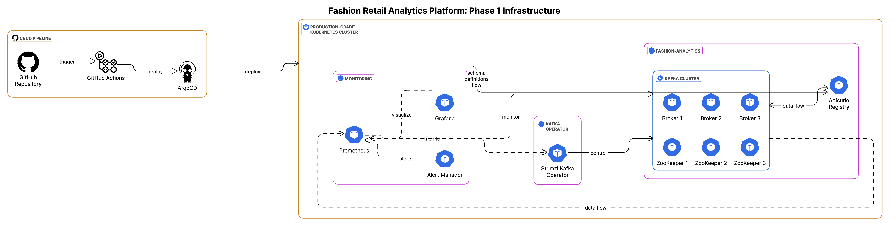

# Fashion Analytics Platform

A production-grade fashion retail analytics platform using Kafka and Kubernetes, designed with a polyglot architecture that combines Java stream processing with Python analytics.

## Project Overview

This platform enables fashion retailers to process and analyze retail data in real-time, helping marketing and sales teams make data-driven decisions. The project follows a structured approach with four phases:

1. **Infrastructure Setup** (Current Phase)
2. **Stream Processing Applications**
3. **Analytics Services**
4. **Visualization & Dashboards**

## Phase 1: Infrastructure Setup

The first phase establishes a (near) production-grade infrastructure using GitOps principles.

### Architecture



The infrastructure consists of:

- **Kubernetes Cluster**: Using Kind for local development, designed for EKS/GKE/AKS in production
- **Kafka Cluster**: Managed by Strimzi Operator with 3 brokers (1 for local dev)
- **Schema Registry**: Apicurio Registry for schema governance
- **Monitoring Stack**: Prometheus and Grafana for observability
- **GitOps Pipeline**: ArgoCD and GitHub Actions for continuous deployment

### Key Components

#### Kafka Infrastructure
- Strimzi Kafka Operator for managing Kafka resources
- Multiple Kafka topics for different data domains:
  - `fashion-orders`: Customer purchase data
  - `fashion-products`: Product catalog information  
  - `fashion-trends`: Aggregated trend analysis
  - `fashion-recommendations`: Personalized recommendation data
- Metrics collection for monitoring

#### Schema Registry
- Apicurio Registry for managing Avro schemas
- Kafka storage backend for persistence
- REST API for schema registration and retrieval

#### Monitoring & Observability
- Prometheus for metrics collection
- Grafana dashboards for visualization
- Alerts for critical conditions

#### GitOps Workflow
- GitHub repository as the single source of truth
- GitHub Actions for CI (validation)
- ArgoCD for CD (deployment)
- Declarative configuration with Kubernetes manifests and Helm charts

### How Components Work Together

The infrastructure is designed with a layered approach where each component builds on the foundation provided by others:

1. **Base Layer**: Kubernetes cluster provides the foundation
   - Storage classes define how persistent data is stored
   - Namespaces isolate different components

2. **Operator Layer**: Custom controllers that extend Kubernetes
   - Strimzi operator manages Kafka resources
   - Apicurio operator manages Registry resources
   - Prometheus operator manages monitoring resources

3. **Service Layer**: The actual services running on the platform
   - Kafka brokers handle message streaming
   - ZooKeeper provides coordination (will be replaced by KRaft)
   - Apicurio Registry stores and validates schemas
   - Prometheus collects metrics
   - Grafana visualizes metrics

4. **Integration Layer**: How services communicate
   - Kafka topics enable communication between components
   - Schema Registry ensures data compatibility
   - Monitoring provides visibility across all components

#### Integration with Helm and Kustomize

Our architecture leverages both Helm and Kustomize for different purposes:

**Helm** is used for complex application deployments:
- Strimzi Kafka Operator: `helm install strimzi-kafka-operator strimzi/strimzi-kafka-operator`
- Prometheus Stack: `helm install monitoring prometheus-community/kube-prometheus-stack`

**Direct YAML Application** is used for custom resources:
- Kafka Cluster definition
- Kafka Topics
- Apicurio Registry instance

This hybrid approach gives us the best of both worlds:
- Helm for complex applications with many interdependent resources
- Direct YAML files for custom resources that are specific to our application

### Technical Decisions

1. **Strimzi vs. Confluent**: Using open-source Strimzi for Kafka management in Kubernetes
2. **Apicurio vs. Confluent Schema Registry**: Using open-source Apicurio for schema management
3. **Ephemeral vs. Persistent Storage**: Configurable for different environments
4. **GitOps Approach**: Infrastructure as Code with automated deployments
5. **Polyglot Architecture**: Combining Java for stream processing with Python for analytics

#### Why use both GitHub Actions and ArgoCD?

They serve complementary roles in a mature CI/CD pipeline:
##### GitHub Actions (CI):
- Handles the continuous integration process
- Runs tests, performs static code analysis, and security scans
- Builds Docker images and pushes them to a registry
- Validates Kubernetes manifests before deployment
##### ArgoCD (CD):
- Handles the continuous delivery/deployment process
- Implements GitOps principles where your desired cluster state is defined in Git
- Continuously synchronizes what's in your Kubernetes cluster with what's in your Git repository
- Provides automated rollbacks and drift detection
- Makes it easy to manage multiple environments (dev, staging, prod)

This separation allows you to have automated testing and image building (GitHub Actions) while maintaining infrastructure-as-code principles for your Kubernetes deployments (ArgoCD).


### Directory Structure

```
fashion-analytics/
├── infrastructure/                   # Phase 1: Infrastructure setup
│   ├── kubernetes/                   # Kubernetes configurations
│   │   ├── kind-config.yaml          # Local development cluster config
│   │   ├── kafka/                    # Kafka resources
│   │   │   ├── kafka-cluster.yaml    # Kafka cluster definition
│   │   │   ├── metrics/              # Metrics configuration
│   │   │   └── topics/               # Topic definitions
│   │   ├── apicurio/                 # Schema registry
│   │   │   └── registry.yaml
│   │   ├── operators/                # Kubernetes operators
│   │   │   └── apicurio/             # Apicurio operator config
│   │   ├── monitoring/               # Monitoring setup
│   │   │   └── prometheus-values.yaml
│   │   ├── storage/                  # Storage configurations
│   │   │   └── storage-class.yaml
│   │   ├── argocd/                   # ArgoCD application definitions
│   │   │   └── applications/
│   │   └── init/                     # Initialization resources
│   │       └── crds-installer.yaml
│   └── scripts/                      # Helper scripts
├── .github/                          # GitHub configuration
│   └── workflows/                    # CI/CD workflows
├── Makefile                          # Automation tasks
└── README.md                         # Project documentation
```

### ArgoCD Setup and Usage

ArgoCD is the core of our GitOps workflow, automatically synchronizing our Kubernetes cluster with the configuration stored in Git.

#### Setting Up ArgoCD

1. **Install ArgoCD**:
   ```bash
   make setup-argocd
   ```

2. **Access the ArgoCD UI**:
   ```bash
   kubectl port-forward svc/argocd-server -n argocd 8080:443
   ```
   Visit https://localhost:8080 and log in with:
   - Username: admin
   - Password: (Get with this command)
     ```bash
     kubectl -n argocd get secret argocd-initial-admin-secret -o jsonpath="{.data.password}" | base64 -d
     ```

3. **Deploy Applications with ArgoCD**:
   ```bash
   kubectl apply -f infrastructure/kubernetes/argocd/applications/
   ```

#### ArgoCD Applications

Our ArgoCD setup includes several application definitions:

1. **Kafka Operator**: Deploys the Strimzi Kafka Operator
   ```yaml
   # infrastructure/kubernetes/argocd/applications/kafka-operator.yaml
   spec:
     source:
       repoURL: https://strimzi.io/charts/
       targetRevision: 0.45.0
       chart: strimzi-kafka-operator
   ```

2. **Kafka Cluster**: Deploys the Kafka cluster and topics
   ```yaml
   # infrastructure/kubernetes/argocd/applications/kafka-cluster.yaml
   spec:
     source:
       repoURL: https://github.com/yourusername/fashion-analytics.git
       path: infrastructure/kubernetes/kafka
   ```

3. **Monitoring Stack**: Deploys Prometheus and Grafana
   ```yaml
   # infrastructure/kubernetes/argocd/applications/monitoring.yaml
   spec:
     source:
       repoURL: https://prometheus-community.github.io/helm-charts
       chart: kube-prometheus-stack
   ```

4. **Apicurio Registry**: Deploys the schema registry
   ```yaml
   # infrastructure/kubernetes/argocd/applications/apicurio-registry.yaml
   spec:
     source:
       repoURL: https://github.com/yourusername/fashion-analytics.git
       path: infrastructure/kubernetes/apicurio
   ```

#### GitOps Workflow with ArgoCD

The typical workflow for making changes to the infrastructure:

1. **Make changes** to the relevant Kubernetes manifests in your local repository
2. **Commit and push** the changes to GitHub
3. **ArgoCD detects the changes** and automatically applies them to the cluster
4. **Monitor the sync status** in the ArgoCD UI

ArgoCD provides several benefits:
- **Automated synchronization**: Changes in Git are automatically applied
- **Drift detection**: Any manual changes to the cluster are detected
- **Rollback capability**: Revert to previous state if needed
- **Visualization**: Clear view of all resources and their status

### Getting Started

#### Prerequisites
- Docker
- Kind
- kubectl
- Helm
- Git

#### Local Development

1. **Clone the repository**:
   ```bash
   git clone https://github.com/yourusername/fashion-analytics.git
   cd fashion-analytics
   ```

2. **Create a local Kubernetes cluster**:
   ```bash
   make create-cluster
   ```

3. **Deploy the infrastructure**:
   ```bash
   make deploy-all
   ```

4. **Verify the deployment**:
   ```bash
   make kafka-status
   make registry-status
   make monitoring-status
   ```

#### Using the GitOps Workflow

1. **Make changes to configuration files**
2. **Commit and push to GitHub**:
   ```bash
   git add .
   git commit -m "Update infrastructure configuration"
   git push
   ```
3. **ArgoCD automatically applies changes**
4. **Verify changes in the ArgoCD UI** at https://localhost:8080

### Troubleshooting

#### Common Issues

1. **Kafka timeout during deployment**:
   - Check resource constraints: `kubectl describe nodes`
   - View detailed information: `make debug-kafka`

2. **Schema Registry connection issues**:
   - Verify Kafka is running: `kubectl get pods -l strimzi.io/cluster=fashion-kafka`
   - Check bootstrap server configuration, ensure it's `fashion-kafka-kafka-bootstrap.fashion-analytics.svc:9092`

3. **ArgoCD sync failures**:
   - Check application status: `kubectl get applications -n argocd`
   - Examine sync errors: `kubectl describe application <name> -n argocd`
   - For Kustomize issues, ensure the CRD is installed: `make setup-crds`

4. **Helm chart version errors**:
   - Ensure you're using compatible versions in your ArgoCD applications
   - Check the chart repository for available versions

### Next Steps

After completing Phase 1, we'll move on to:

1. **Phase 2: Stream Processing Applications**
   - Implementing Kafka Streams applications in Java
   - Real-time aggregation of fashion retail data
   - Stream processing for trend detection